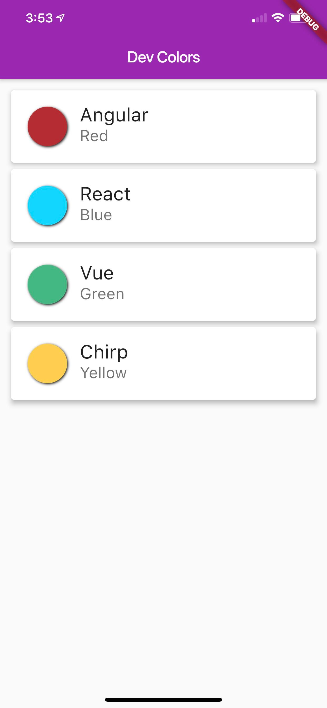

# Chirp Flutter Dev Colors

[](https://codemagic.io/apps/5d082d7737a095485a9c5183/5d082d7737a095485a9c5182/latest_build)

Chirp Flutter Dev Colors - This repository contains Flutter application and python utility. It includes the demo of Chirp SDK on Flutter and how to transmit the data through audio to set the color of the light bulb.

## Overview

I recently started exploring ChirpSDK - SDK for transmitting data through audio when I explore one of the non-internet or less costly hardware options for IoT solutions to transmit the data. 

Chirp enables your apps to send and receive information using sound. A "chirp" encodes an array of bytes as an audio signal, which can be transmitted by any device with a speaker and received by any device with a microphone and Chirp SDK. It is designed to be robust over distances of several metres, and in noisy, everyday environments.

As the transmission takes place entirely via audio signals, no internet connection or prior pairing is required, and any device within hearing range can receive the data.

To keep it simple and as having fun, this project is developed in my [twitch streams](https://twitch/tv/ksivamuthu).

## How this solution works?

The idea of the project is we are going to send the data from mobile to another device through audio.

I've built this Flutter application that has list of dev brand main colors. For e.g

    * Angular Red
    * React Blue
    * Vue Green
    * Chirp Yellow

When you taps one of the list item, the app is sending the HEX value of the color through the audio. Then the python application running in my machine receives the audio through microphone, decodes the HEX value. Then its calling Philips HUE Bridge API to set the color of the light.

If you tap "Angular Red", then it sets the light bulb color to red through audio signal.

<p float="left" align="center">
    
    
</p>

## Prerequisites

* [Flutter](https://flutter.dev/docs)
* [Chirp SDK](https://developers.chirp.io)
* [Python](https://www.python.org/downloads/)
* [Philips Hue Light Bulb](https://www2.meethue.com/en-us) **
* Mobile device - iOS or Android

> ** You can use other bulbs or models. You might need to update the code to call the API.

## How to run?

### Configure your Chirp Applications.

To configure your chirp app, navigate to the [applications](https://developers.chirp.io/applications) page and select a protocol. Copy and paste the key, secret and config string into your app.

### Configure your Wireless Hue Light Bulb

Please follow the instruction in [meethue developers page](https://developers.meethue.com/develop/get-started-2/)

### Chirp Flutter Project

* Navigate the chirp_flutter_light directory and run "flutter run" or use VSCode to run the flutter app.  
    ```bash
    cd chirp_flutter_light
    flutter run ios
    ```
* To configure the SDK you will need to copy your app_key, app_secret, and app_config from the applications page and set this in main.dart file
    ```
    String _appKey = '<Chirp_App_Key>';
    String _appSecret = '<Chirp_App_Secret>';
    String _appConfig = '<Chirp_App_Config>';
    ```

### Python program to listen audio

* To configure the pythone SDK you will need to copy your app_key, app_secret, and app_config from the applications page and paste into your ~/.chirprc file.

  ```
    [default]
    app_key = xXxXXxxxXXXxxXXXxXxXXxXxx
    app_secret = xxXxXXXxXxxXXXxXXXXxXxXxxxXxxxXXxXxXxxxXXxXxXXxXxX
    app_config = XxXXXXxXxXxxxXxxxXXxXxXxxxXXxXxXXxXxXxxXxXXXxXxxXXXxXXXXxXxXxxxXxxxXXxXxXxxxXXxXxXXxXxX
  ```

* Navigate to the python directory and install pip requirements
    ```bash
    cd python
    pip3 install -r requirements.txt
    ```

* Setup your Philips Hue Bridge API IP Address, Username and lightId of your bulb to control, in [index.py](python/index.py#L21)
    ```python
    ipAddress = "<IP_ADDRESS>"
    userId = "<HUE_USERID>"
    lightId = <LIGHTID>
    ```

* Run the python program to listen the audio
    ```bash
    python3 index.py
    ```

## Demo

[](https://youtu.be/XvyMYcOwpY8)

## Contributing

Contributions are what make the open source community such an amazing place to be learn, inspire, and create. Any contributions you make are greatly appreciated.

* Fork the Project
* Create your Feature Branch (git checkout -b feature/AmazingFeature)
* Commit your Changes (git commit -m 'Add some AmazingFeature)
* Push to the Branch (git push origin feature/AmazingFeature)
* Open a Pull Request
  
## License

Distributed under the MIT License. See LICENSE for more information.
